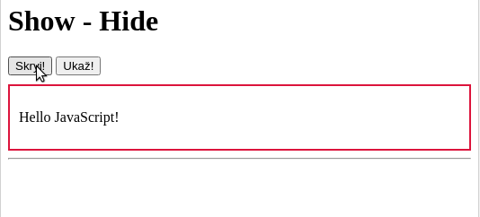
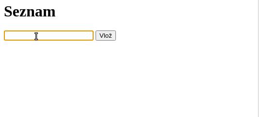
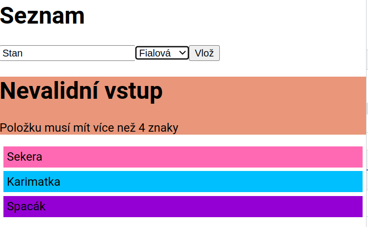
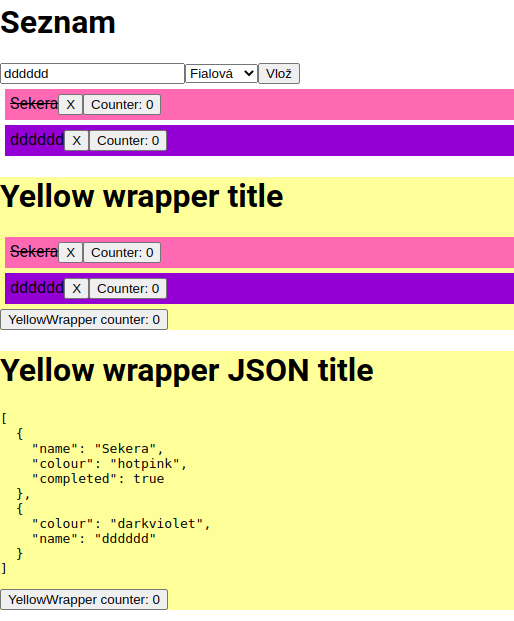
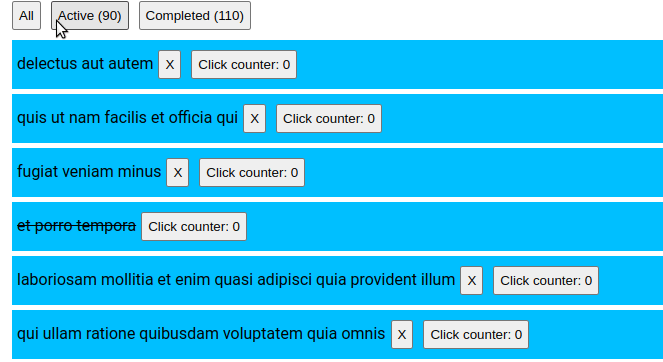
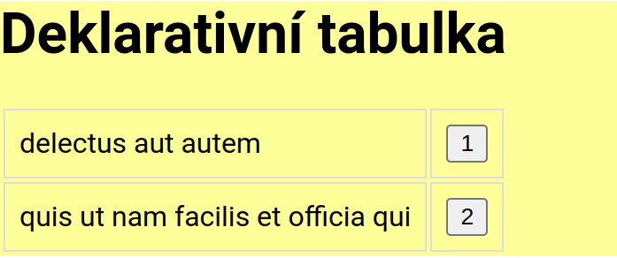
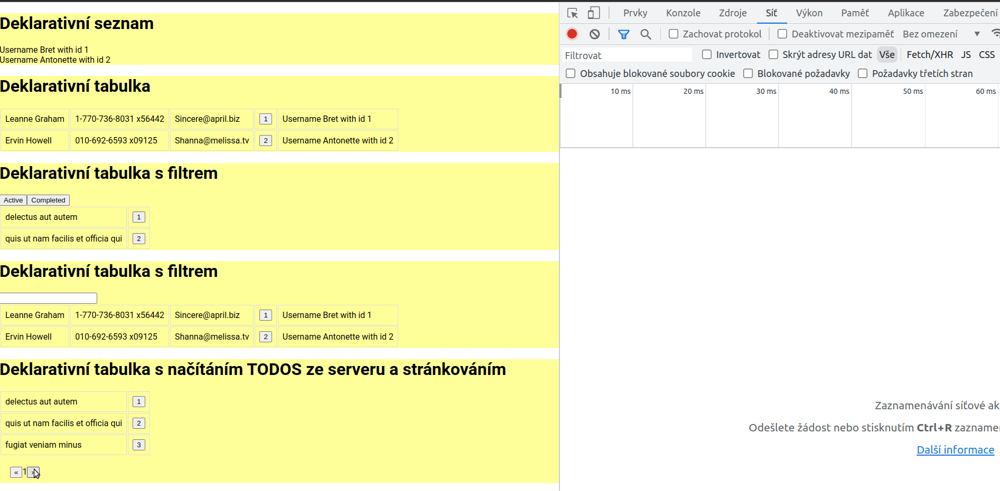
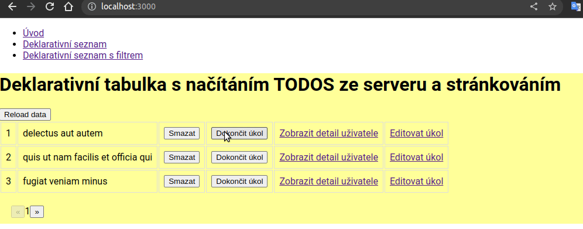
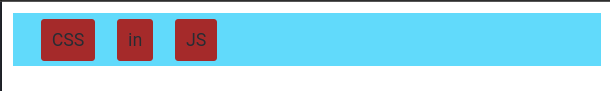
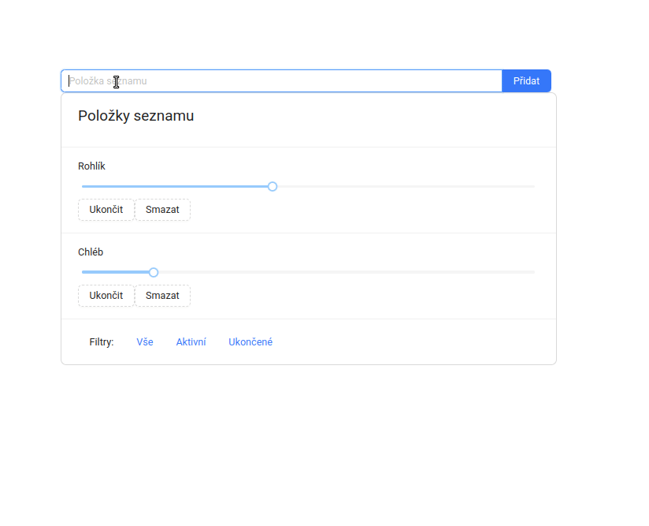

# 1 - JavaScript, Historie, Trendy, FrameWorky

(04-10-2022)

- prezentace

Workshop:

- pomocí HTML a JavaScriptu vytvořte následující funkcionalitu:
    - show-hide
    - formulář, který vkládá do seznamu
    - bonus: z formuláře lze odebírat

| Skryj-Ukaž           | Seznam              |
|----------------------|---------------------|
|   |  |

Domácí úkol:

- rozjet prostředí + commit vytvořené výchozí komponenty

```shell
npx create-react-app my-app
cd my-app
npm start
```

# 2 - React - syntaxe, principy, první aplikace

(11-10-2022)

- vytvoření komponenty
- kompozice komponent (children)
- základní stylování
- props a useState

Workshop:

- vytvoření první komponety (`<ListItem item={}>`) založené na `<div>` pro výpis prvrku
- výpis položek seznamu do komponenty `<ListItem>`
- přidávání do seznamu
- použití onChange na `<input>`
- validovat data ve vstupním poli a vykreslit stylovanou `<Error>` komponentu
- ukázat použití reference na funkci

Domácí úkol

- přidání druhého vstupního prvku typu `<select>` pro výběr barvy
- hodnota barvy se použije pro styl
  

# 3 - React - opakování

(18-10-2022)
Workshop

- přidání přeškrtnutí položky v seznamu
- serializace JSON objektu
- props.children (kompozice)
- počítadlo
- reference na funkci
- řízené a neřízené vstupy

```javascript
function App() {
    const [data, setData] = useState({
        inputValue: "",
        inputValueColour: "deepskyblue"
    });

    const setFormValue = (event) => {
        setData((prevData) =>
            ({...prevData, [event.target.name]: event.target.value}))
    }

    return <input value={data.inputValue}
                  name="inputValue"
                  type="text"
                  onChange={setFormValue}/>;
}
```



# 4 - React - props vs state, useEffect

(25-10-2022)

- využití useEffect, závislostí a cleanup
- načítání dat ze serveru

```javascript
useEffect(() => {
    setNumber(number + 1)
}, [number])
```

```javascript
useEffect(() => {
    const interval = setInterval(() => {
        setNumber((prev) => prev + 1)
    }, 1000);

    return () => { //cleanup function
        clearInterval(interval)
    }
}, [number])
```

```javascript
 const fetchData = async () => {
    const response = await fetch('https://jsonplaceholder.typicode.com/todos')
    if (!response.ok) {
        throw new Error('Data could not be fetched!')
    }
    setData(await response.json())
}

useEffect(() => {
    fetchData()
}, []) // load only once
```

# 5 - React - opakování

(01-11-2022)

opakování

- filtrování dle atributů (na straně klienta)
- callbacky z podřízené komponenty
- stavy v různých komponetách



# 6 - React - implementace deklarativní komponenty

(08-11-2022)


Workshop:
- deklarativní seznam
- deklarativní tabulka
- univerzální načítání ze serveru
- deklarativní filtrování dle atributů (na klientu)
- [jsonserver](https://www.npmjs.com/package/json-server)

```shell
npm install -g json-server
```

```shell
json-server --watch db.json --port 3004
```

```javascript

const data = [
    {
        "userId": 1,
        "id": 1,
        "title": "delectus aut autem",
        "completed": false
    },
    {
        "userId": 1,
        "id": 2,
        "title": "quis ut nam facilis et officia qui",
        "completed": false
    },
]

const columns = [
    {
        attribute: "title"
    },
    {
        attribute: "id",
        component: (item) => <button>{item.id}</button>
    }
]

return <Table data={data} columns={columns}/>;
```


Úkol:
- přidejte stránkování (stránkování na serveru)
- přidejte řazení (volitelné)




# 7 - React - npm, react router a práce s API

(15-11-2022)

- práce s REST API (GET, PUT, POST, DELETE)
  - workshop: po kliknutí na tlačítko smazat záznam z DB (HTTP Request s metodou `DELETE`)
- React router (https://v5.reactrouter.com/web/guides/quick-start)
  - workshop: po kliknutí na tlačítko zobrazte detail uživatele, který založil tásk

Úkol:
  - po kliknutí na tlačítko změnte stav úkolu (persistentní změna přes REST API) atribut `completed` 
  - po kliknutí na tlačítko přejděte na editaci úkolu (použijte react-router)
    - zobrazí se formulář, který může umožní editaci položky a umožní změny uložit persistentně

K zamyšlení:
  - centralizace metod na provolání REST API 



HINT pro změnu stavu na `completed`:
```http request
PATCH http://localhost:3004/todos/5
Content-Type: application/json

{
  "completed": true
}

```

# 8 - projekt - zadání práce a ukládání dat na straně klienta

(22-11-2022)

- UI knihovny (https://blog.logrocket.com/top-11-react-ui-libraries-kits/)
  - workshop: použití tabulky [rsuite.js](https://rsuitejs.com/components/table/) s TODO daty
- Styled components (CSS in JS)
  - workshop:



```javascript

import styled from 'styled-components';

const AppDiv = styled.div`
  padding: 15px;
  background-color: #61dafb;
  margin: 10px;
`;

const AppLink = styled.span`
  background-color: brown;
  padding: 10px;
  margin: 10px;
  color: #282c34;
  border-radius: 3px;
`;

function App() {
  return (
    <AppDiv>
      <AppLink>CSS</AppLink>
      <AppLink>in</AppLink>
      <AppLink>JS</AppLink>
    </AppDiv>
  );
}

```

Úkol:
- vytvořte formulář pro přidání položky ((persistentní změna přes REST API))


# 9 - projekt - konzultace

(29-11-2022)
### Zadání práce

Cílem práce je vytvořit nákupní seznam. Do seznamu se položky mohou přidávat, mazat, označit za nakoupené a také lze
upravit počet položek ke koupi.

Veškerá práce s daty je na backendu (řeč je filtrování a řazení)

API:
- GET `shoppingList` - výpis všech položek
- POST `shoppingItem` - vytvoření nové položky
- PUT `shoppingItem` - editace položky (PATCH bohužel v json-serveru nefunguje)
- DELETE `shoppingItem` - mazání položky




# 10 - projekt - hodnocení

(6-12-2022)
- napojení localStorage a cookies
- useContext
- vyhodnocení semestrální práce
- nasazení aplikace na server
  
Úkol:
- do localStorage uložte naposledy použité filtry / stránkování

