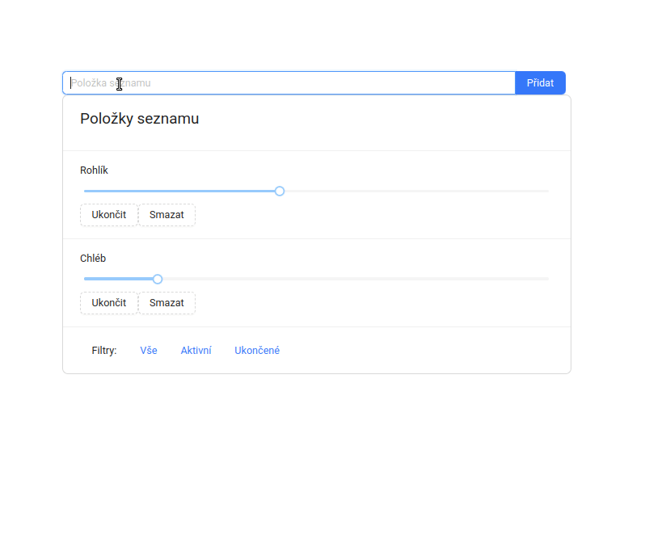

# Zadání závěrečné práce

Cílem práce je vytvořit nákupní seznam. Do seznamu se položky mohou přidávat, mazat, označit za nakoupené a také lze
upravit počet položek ke koupi.

Veškerá práce s daty je na backendu (řeč je především filtrování)

API:
- GET `shoppingList` - výpis všech položek
- POST `shoppingItem` - vytvoření nové položky
- PUT `shoppingItem` - editace položky (PATCH bohužel v json-serveru nefunguje)
- DELETE `shoppingItem` - mazání položky


#### Základní požadavky na aplikaci
- uživatel může přidat novou položku
- položky jsou zobrazeny v seznamu
- seznam podporuje filtrování (minimálně podle stavu)
- položce lze změnit stav
- položku lze vymazat



#### Bonusové požadavky
- seznam položek lze řadit (lze implemetovat na serveru nebo na klientu)
- přidejte další zajímavý atribut
- notifikace o uložení / načtení
- ošetření chybových stavů ze serveru
- zobrazit loader během načítání dat ze serveru
- přidejte další zajímavou funkčnost

# Jak spustit API
V tomto adresáři spustit `json-server` s custom routes:
```
json-server --watch db.json --port 3004 --routes routes.json
```

# Popis entity 

```
{
  "id": int(),
  "content": string(),
  "count": int(),
  "state: oneOf("active", "completed"),
  "createdAt": datetime() // optional
  // můžete doplnit i více položek
}
```

# Popis API

## Shopping item Collection [/shoppingList]

### List All Shopping items [GET]
Získání všech položek seznamu.

+ Request (application/json)
```json
{
}
```
+ Response 200 (application/json)

```json
[
  {
    "id": 1,
    "content": "Rohlík",
    "count": 2,
    "state": "active",
    "createdAt": "2022-08-05T08:40:51.620Z"
  },
  {
    "id": 2,
    "content": "Chleba",
    "count": 5,
    "state": "completed",
    "createdAt": "2022-08-05T08:40:51.620Z"
  }
]
```
## Shopping item Collection [/shoppingItem]

### Create a Shopping Item [POST]

Vytvoření nové položky seznamu. 
API (json-server) automaticky přidá k vašemu objektu `ID` a uloží ho.

+ Request (application/json)
```json
{
  "content": "Rohlík",
  "count": 10,
  "state": "active",
  "createdAt": "2022-08-05T08:40:51.620Z"

}
```
+ Response 201 (application/json)

```json
{
    "id": 1, 
    "content": "Rohlík",
    "count": 10,
    "state": "active",
    "createdAt": "2022-08-05T08:40:51.620Z"
}
```
### Update a Shopping Item [PUT]

Parametrem je celý objekt, který se má uložit.
Volání na adrese `/shoppingItem/:id`.

+ Request (application/json)
```json
{
    "id": 1,
    "content": "Rohlík",
    "count": 10,
    "state": "active"
}
```

- Response 201 (application/json)

```json
{
    "id": 1,
    "content": "Rohlík",
    "count": 10,
    "state": "active",
    "createdAt": "2022-08-05T08:40:51.620Z"
}
```

### Delete a Shopping Item [DELETE]

Smazaní objektu z databáze.
Volání na adrese `/shoppingItem/:id`.

Při úspěšném volání vrátí `http status 200`.

t body;
    if(dtoIn){
      body = JSON.stringify(dtoIn);
    }
- Request (application/json)
```json
{
}
```
- Response 200 (application/json)
```json
{
}
```
